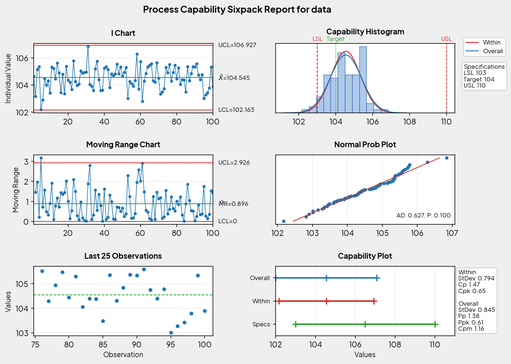

# Capability Sixpack Report

Generate a Minitab-style capability sixpack report with Python and Matplotlib.

## Example Output



## Quick Start

```bash
python src/sixpack_report.py
```

The script writes `output/sixpack_report.png` and prints a short capability summary.

## Usage

```python
from pathlib import Path

from src.sixpack_report import CapabilitySpecs, generate_sixpack

values = [
    104.0, 104.4, 103.8, 105.1, 104.9,
    105.2, 104.7, 104.1, 104.6, 105.0,
]
specs = CapabilitySpecs(lsl=103.0, usl=110.0, target=104.0)

stats = generate_sixpack(
    values,
    specs,
    "Process Capability Sixpack Report",
    Path("output/sixpack_report.png"),
)

print(stats)
```

## Project Notes

- The report layout mirrors Minitab's sixpack with I/MR charts, histogram, probability plot, last 25 observations, and a capability plot.
- Fonts load from the bundled Plus Jakarta Sans files when available.
