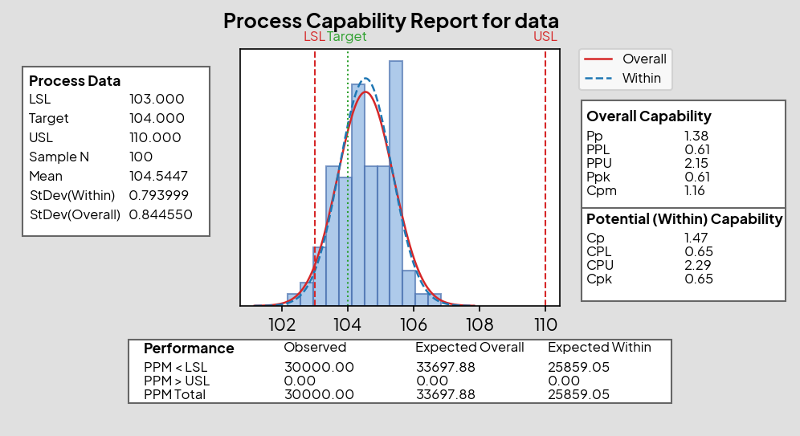
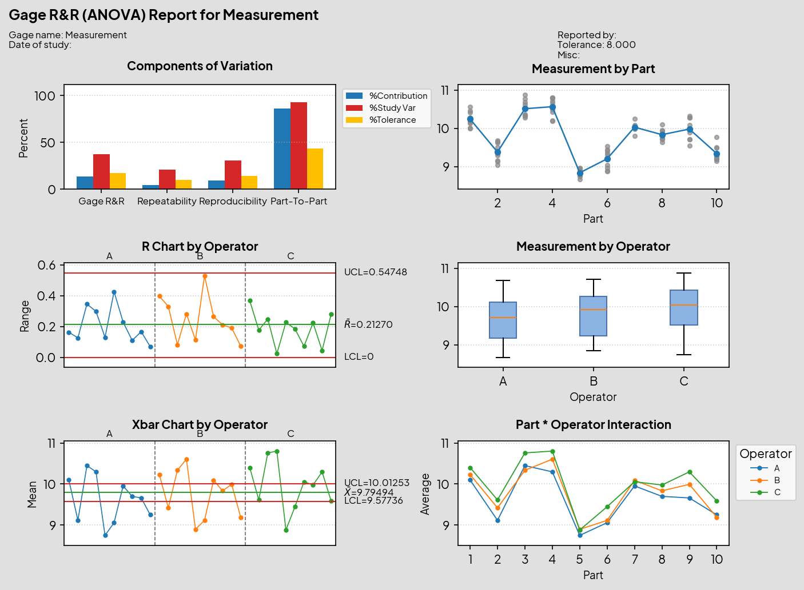
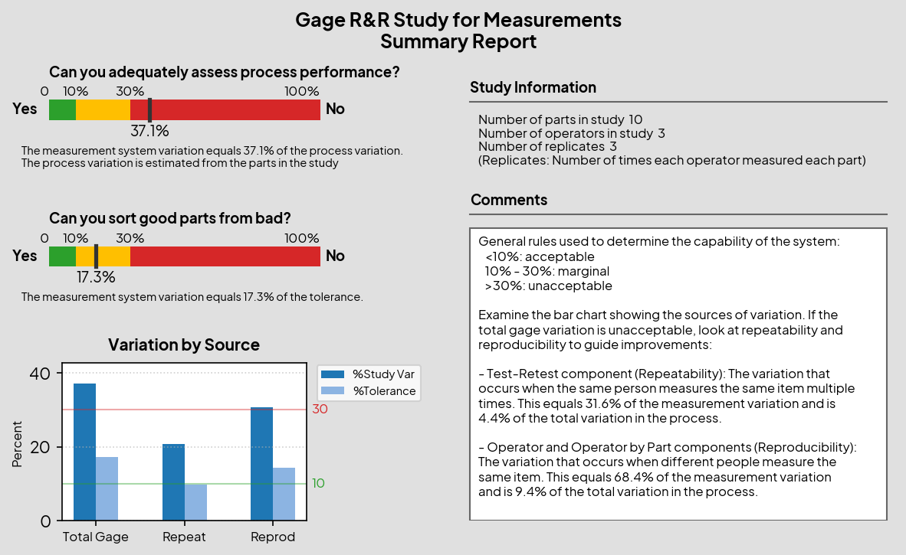

# Capability Sixpack Report

Generate Minitab-style capability sixpack, capability analysis, and Gage R&R reports with Python and Matplotlib.

## Features

- **Capability Sixpack** - I/MR control charts, histogram, probability plot, last 25 observations, and capability indices (Cp, Cpk, Pp, Ppk, Cpm)
- **Capability Analysis (Normal)** - Capability histogram with process data, overall/within indices, and PPM performance summary
- **Gage R&R Study (ANOVA)** - Full ANOVA analysis with variance components, % study variation, % tolerance, and distinct categories
- **MSA Assistant** - Automated interpretation of Gage R&R results with pass/fail assessment against AIAG MSA guidelines

## Example Output

### Capability Sixpack


### Capability Analysis (Normal)


### Gage R&R Report


### MSA Assistant


## Quick Start

### Capability Sixpack
```bash
python src/sixpack_report.py --download-fonts
```

### Capability Analysis (Normal)
```bash
python src/sixpack_report.py --capability-analysis --download-fonts
```

### Gage R&R Study
```bash
python src/sixpack_report.py --gage-rr --download-fonts
```

## Usage

### Capability Sixpack

```python
from pathlib import Path
from src.sixpack_report import CapabilitySpecs, generate_sixpack

values = [
    104.0, 104.4, 103.8, 105.1, 104.9,
    105.2, 104.7, 104.1, 104.6, 105.0,
]
specs = CapabilitySpecs(lsl=103.0, usl=110.0, target=104.0)

stats = generate_sixpack(
    values,
    specs,
    "Process Capability Sixpack Report",
    Path("output/sixpack_report.png"),
)

print(stats)
```

### Capability Analysis (Normal)

```python
from pathlib import Path
from src.sixpack_report import CapabilitySpecs, generate_capability_analysis

values = [
    104.0, 104.4, 103.8, 105.1, 104.9,
    105.2, 104.7, 104.1, 104.6, 105.0,
]
specs = CapabilitySpecs(lsl=103.0, usl=110.0, target=104.0)

result = generate_capability_analysis(
    values,
    specs,
    "Process Capability Report",
    Path("output/capability_analysis_report.png"),
)

print(result.stats)
```

### Gage R&R Study

```python
from pathlib import Path
from src.sixpack_report import (
    GageRrRecord, GageRrSpecs, generate_gage_rr_report
)

# Your measurement data
records = [
    GageRrRecord(part="1", operator="A", measurement=10.02),
    GageRrRecord(part="1", operator="A", measurement=10.05),
    # ... more measurements
]

specs = GageRrSpecs(
    tolerance=8.0,
    gage_name="Calipers",
    reported_by="Quality Engineer",
)

result = generate_gage_rr_report(
    records,
    "Gage R&R (ANOVA) Report",
    Path("output/gage_rr_report.png"),
    specs=specs,
    assistant_output_path=Path("output/gage_rr_assistant.png"),
)

print(f"Distinct Categories: {result.distinct_categories}")
print(f"Interaction p-value: {result.interaction_p_value:.3f}")
```

## Project Notes

- Download fonts once: `python src/sixpack_report.py --download-fonts` fetches Plus Jakarta Sans into `src/assets/fonts/plus_jakarta_sans`
- Reports automatically use downloaded fonts when present
- Gage R&R follows AIAG MSA guidelines for ANOVA analysis and variance component calculation
- MSA Assistant interprets %Study Var and %Tolerance against standard criteria (<10% acceptable, 10-30% marginal, >30% unacceptable)
